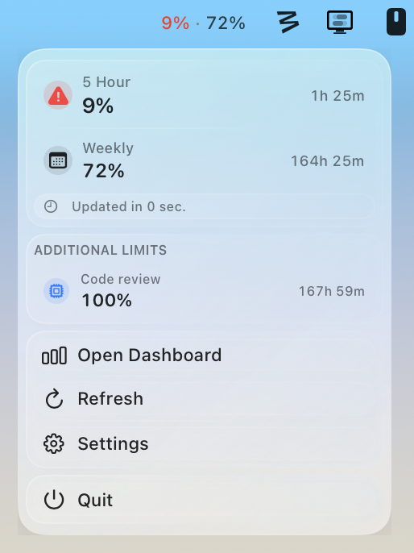

# ChatGPT Codex Usage Tray

A lightweight macOS menu bar app for checking your ChatGPT Codex usage without keeping the website open all day.

Adapted from [adntgv/claude-usage-systray](https://github.com/adntgv/claude-usage-systray) and tailored for ChatGPT Codex on macOS.

## What It Does

ChatGPT Codex Usage Tray lives in your menu bar and gives you a quick snapshot of:

- 5 Hour usage
- Weekly usage
- additional limits when they are available
- time remaining until each limit resets
- quick actions for refresh, settings, and opening the Codex dashboard

The goal is simple: make your usage feel visible, lightweight, and native to macOS.

## Highlights

- Native-style menu bar experience
- Compact quota summary directly in the menu bar
- Fast dropdown for current usage and reset timing
- Borderless native-feeling Settings window with liquid glass styling that complements the native tray popup without overriding it
- Automatic use of your existing Codex desktop sign-in when possible
- Secure fallback session storage in macOS Keychain
- Optional notifications as you approach your limit

## Requirements

- macOS 13 or later
- A working ChatGPT Codex session on your Mac

## Getting Started

Open [`codex-usage-systray/CodexUsageSystray.xcodeproj`](codex-usage-systray/CodexUsageSystray.xcodeproj) in Xcode, select the `CodexUsageSystray` scheme, and run the app on `My Mac`.

Because this is a menu bar utility, it launches into the menu bar rather than opening a normal app window.

## Authentication

The app first tries to use your local Codex desktop sign-in automatically.

If that is not available, you can add fallback session details in Settings. Those values are validated and stored securely in your macOS Keychain.

## Notes

- This project depends on the current ChatGPT Codex usage experience remaining available.
- The app is designed to feel like a small native utility, not a full desktop dashboard.

## Credits

- Original project: [adntgv/claude-usage-systray](https://github.com/adntgv/claude-usage-systray)
- This repository adapts that idea for ChatGPT Codex usage on macOS
